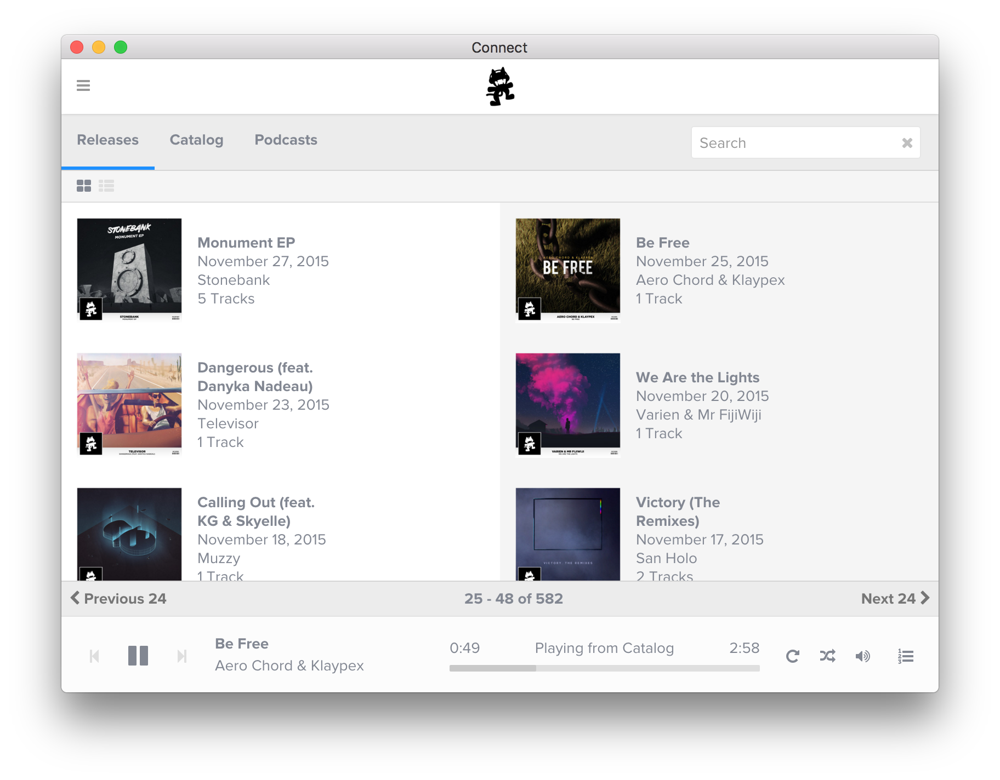

# Unofficial Monstercat Connect Desktop App 



> I am not affiliated with Monstercat, This was built without their knowledge or consent, if anyone from Monstercat wants this removed I will take it down immediately.

## Description

This project stemmed from my love of Monstercat Connect and my frustration with the various chrome extensions for media key mappings that just don't work :c

So I threw this together in [electron](https://github.com/atom/electron), and it works pretty well!

All it does is open a chromium window to [https://connect.monstercat.com](https://connect.monstercat.com) and binds the media keys to the play/pause, next and previous buttons, and clicks the buttons using JS.

That's literally it.

## Downloads

You can download the first build of the app here:

* [OS X](releases/download/v0.1-alpha/OS.X.-.Unofficial.Monstercat.Connect.Desktop.dmg)

* [Windows](releases/download/v0.1-alpha/Windows.-.Unofficial.Monstercat.Connect.Desktop.Setup.exe)

The windows build has not been tested yet, but should work

## Ideas/Issues

Please use [the issue tracker](issues/new) to report any bugs you find or any ideas you have that could make the app better!

## Graphics
The graphics distributed with and used in this app were grabbed from [https://www.monstercat.com/essentials/](https://www.monstercat.com/essentials/) and belong to Monstercat.

The app icons ([windows](assets/win/icon.ico)/[OS X](assets/osx/mount.icns)) are a white circle with [The Cat](https://www.monstercat.com/essentials/logos/monstercat_logo_final_noshaddow.ai) placed on top. The PSD is included in the repo [here](assets/Monstercat Connect Desktop.psd).

The installer background on OS X is the a still from [the video](http://data.monstercat.com/files/MC_CLIP_no_Text.f4v) with the cat in the middle photoshopped out for space for the icons to sit.

## Thanks

* To of course Monstercat for existing and making Monstercat Connect awesome!

* To all the artists who make amazing music that are signed to Monstercat

* The devs that built Monstercat Connect - The website is really nice and responsive and was easy to interface with, props!

* To the guys that made [electron](https://github.com/atom/electron), [electron packager](https://github.com/maxogden/electron-packager), and [electron builder](https://github.com/loopline-systems/electron-builder) for making this so easy to build

----


## If you're not a developer stop reading here

-----


## Source 

This is a super simple app, and boils down to a 37 lines of code which is pretty self explanatory.

The interesting bit is in [app/main.js](app/main.js), it logs to console when anything that the app controls happens.

## Prerequisites

If you want to run this from source you'll need to install `electron-prebuilt`, you can do this by running

```
npm install electron-prebuilt
``` 
in the project folder.

If you also want to be able to package it yourself then you'll also need `electron-builder` and `electron-packager`.
These are designed to be ran on command line so you'll need to run the installation command as global and therefore elevated (sudo on *nix, elevated command prompt on windows)

```
sudo npm install -g electron-builder electron-packager
```

You will need wine and makensis for these modules to work, check [their docs](https://www.npmjs.com/package/electron-builder#pre-requisites) for instructions on how to set these up for your system.


## Packaging
This app is intended to be usable for non-devs (obviously), so it has been packaged up for Windows and OS X.

There are a few scripts for *nix systems in the [package.json](package.json) file which I used to do this, you can run these by going

```
npm run <command>
```


### start
Starts electron with main.js

### clean
Deletes everything in the /dist folder

### build
Runs the build process for both OS X and Windows, generating an .exe and .app for each platform respectively.

#### build:osx
Runs `electron-packager` on the [app folder](app) specifying building for OS X (darwin), 64 bit, with the latest version of electron at the time of writing and a few other arguments, then runs rearrange:osx

#### build:win
Runs `electron-packager` on the [app folder](app) specifying building for Windows (win32), 32 bit, with the latest version of electron at the time of writing and a few other arguments, then runs rearrange:win

### rearrange:osx
Moves all the built files/folders out of their subdirectory and into the /dist/osx folder's root.

### rearrange:win
Moves all the built files/folders out of their subdirectory and into the /dist/win folder's root.

### pack
Runs the building and packaging process for both OS X and Windows

#### pack:osx
Runs build:osx, then `electron-builder` with a load of arguments specifying the app to be packaged, the platform for it to be packaged for (osx), and the config ([packager.json](packager.json)).

#### pack:win
Runs build:win, then `electron-builder` with a load of arguments specifying the app to be packaged, the platform for it to be packaged for (win), and the config ([packager.json](packager.json)).

## License

[DBAD](license.md)
